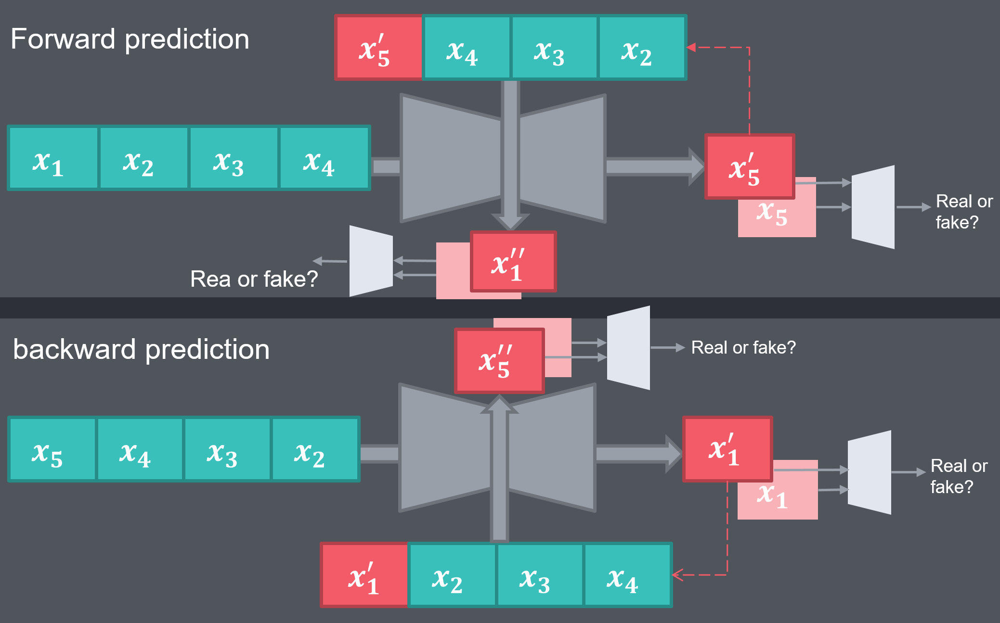

# Retrospective_Cycle_GAN_Pytorch
**this reposityry contains the Pytorch implementations of this paper: [Predicting Future Frames Using Retrospective cycle GAN](https://openaccess.thecvf.com/content_CVPR_2019/papers/Kwon_Predicting_Future_Frames_Using_Retrospective_Cycle_GAN_CVPR_2019_paper.pdf).**

* [get_dataset: ](https://github.com/taravatp/Predicting_Future_Frames_Using_Retrospective_Cycle_GAN_pytorch/blob/main/dataset_prepration/get_dataset.ipynb): Contains all the codes for downloading the UDF101 dataset, organizing the dataset in folders, and converting video data to image data.
* [image_extractor.py](https://github.com/taravatp/Predicting_Future_Frames_Using_Retrospective_Cycle_GAN_pytorch/blob/main/dataset_prepration/image_extractor.py): Codes for converting video data to image data. The implementations is borrowed from the code in [this](https://github.com/va26/Retrospective-Cycle-GAN--tensorflow/blob/main/image_extractor.py) file.
* [Dataset.ipynb](https://github.com/taravatp/Predicting_Future_Frames_Using_Retrospective_Cycle_GAN_pytorch/blob/main/dataset_prepration/Dataset.ipynb): Processes the raw data to be loaded by the Pytorch Dataloaders. Each loaded sample will include 5 images. According to the paper, in the forward scenario, the first four images will be fed into the model and the fifth image is our target image.
* [models.ipynb](https://github.com/taravatp/Predicting_Future_Frames_Using_Retrospective_Cycle_GAN_pytorch/blob/main/models.ipynb): Contains implementations of the generator and discriminator according to what was described in the paper.

* [train.ipynb](https://github.com/taravatp/Predicting_Future_Frames_Using_Retrospective_Cycle_GAN_pytorch/blob/main/models.ipynb): Code for training the GAN network according to the method suggested by the author of the [paper](https://openaccess.thecvf.com/content_CVPR_2019/papers/Kwon_Predicting_Future_Frames_Using_Retrospective_Cycle_GAN_CVPR_2019_paper.pdf). the following image showcases the entire strategy of training:

## Results:
https://github.com/taravatp/Predicting_Future_Frames_Using_Retrospective_Cycle_GAN_pytorch/blob/main/Results/groundTruth_video.mp4
